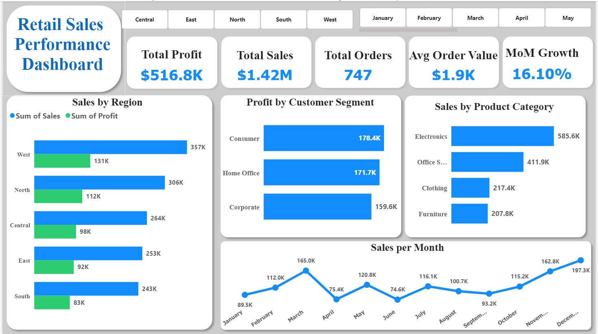

# retail-sales-analysis
Retail sales performance analysis using Excel, Power BI, and SQL- identifying regional discount inefficiencies and seasonal trends.

## Business Problem
A mid-sized retail company wanted to understand sales performance across regions, products, and customer segments to guide pricing and marketing decisions — specifically whether its regional discounting strategy was helping or hurting profitability.

## Tools Used
Excel (data cleaning, PivotTables) | Power BI (interactive dashboard) | SQL (verification queries)

## Key Findings
- South region's average discount (25.9%) is 3-4x every other region's, yet produces the lowest sales and profit margin
- Smartphone is the single highest-profit product (~$46.8K), nearly 40% ahead of the next best product
- Clear seasonality: sales peak in December (~$197K), trough in June (~$75K)

## Recommendations
- Test a controlled discount reduction in South over one quarter to check if volume holds
- Prioritize inventory and marketing spend around the December peak

